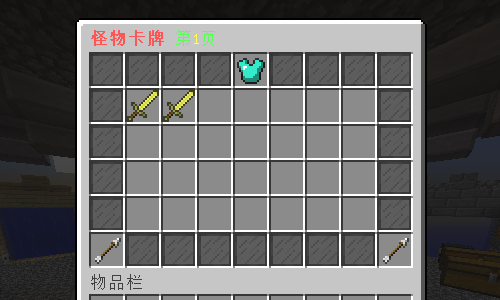
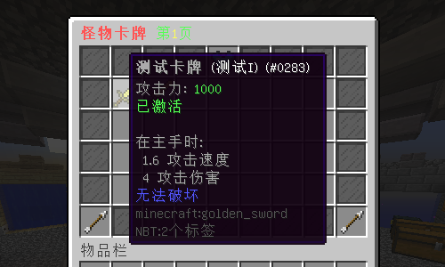
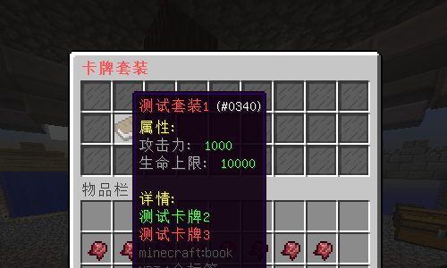

# 插件介绍

# MonsterCard

### **适用版本**

> 1.12.2

### **依赖插件**

> - 必要: MythicMobs
> - 必要: SimpleLib (群内下载)
> - 可选: SX-Attribute 2.0.X
> - 可选: AttributePlus 2.0.X 3.0.X
> - 可选: ItemLoreOrigin

### **插件介绍**

> - 支持Yaml,MySQL存储
> - 配置文件配置卡牌列表(MM物品名)
> - 玩家通过mm物品给予指令获得该卡牌后手持右键即可
> - 属性根据MM物品的Lore所生效
> - 激活卡牌所激活的卡牌开源在插件GUI中查看
> - 卡牌GUI支持翻页,以及部分自定义
> - 支持卡牌套装

### **示例图片**

###### 卡牌演示




###### 卡牌套装




### **配置文件**

```yaml
Config:
  # 您的授权码
  Code: "IKUN-JNTM-SZ666-SUSHAN"
  # 是否使用MySQL
  # false使用SQLite，true使用MySQL
  # 数据库连接配置请在插件 SimpleLib 配置文件中配置
  MySQL: false
  # 卡牌
  Cards:
    - "测试卡牌"
    - "测试卡牌2"
    - "测试卡牌3"
  # 套装

  Gui:
    Title: "§c§l怪物卡牌 §a第§e%page%§a页"
    # 填充物品
    Decorate:
      Name: "§f玻璃板"
      Id: 160
      Data: 15
      Lore:
        - " "
    # 套装
    Suit:
      Name: "§f套装详情"
      Id: 311
      Data: 0
      Lore:
        - "§a点击打开套装界面"
    # 上一页
    PageUp:
      Name: "§f上一页"
      Id: 262
      Data: 0
      Lore:
        - "§a点击打开上一页"
    # 下一页
    PageDown:
      Name: "§f下一页"
      Id: 262
      Data: 0
      Lore:
        - "§a点击打开下一页"
Message:
  reload: "§a配置文件重载成功"
  permission_false: "§a您的权限不够"
  stats_true: "§a已激活"
  pagedown_false: "§a这已经是最后一页了."
  pageup_false: "§a这已经是第一页了."
  card_true: "§a卡牌 §e{0} §a已成功激活."
  card_false: "§a您已经激活过这个卡牌了."
  attribute_true: "§a怪物卡牌属性生效成功."
  online_false: "§a玩家 §e{0} §a不在线"
  level_false: "§a您未达到激活该卡牌的等级要求"
```

#### **套装配置**

```yaml
Template:
  card_true: "§a%card%"
  card_false: "§c%card%"
  suit_true: "§8已激活"
Suit:
  测试套装1:
    Name: "§c测试套装1"
    Id: 340
    Data: 0
    Lore:
      - "§e属性: "
      - "§7攻击力:  §a1000"
      - "§7生命上限:  §a10000"
      - ""
      - "§e详情: %card%"
    Card:
      - "测试卡牌2"
      - "测试卡牌3"
    Index: 10
Gui:
  # Gui标题
  Title: "§c§l卡牌套装"
  # Gui大小 9的倍数(9,18,27,36,45,54)
  Size: 27
  Item:
    # 复制粘贴可按照此格式添加更多物品来自定义GUI
    decorate:
      Name: "§f玻璃板"
      Id: 160
      Data: 15
      Lore:
        - " "
      # 该物品的位子
      Index:
        - 0
        - 1
        - 2
        - 3
        - 4
        - 5
        - 6
        - 7
        - 8
        - 9
    decorate2:
      Name: "§f玻璃板"
      Id: 160
      Data: 15
      Lore:
        - " "
      # 该物品的位子
      Index:
        - 10
        - 11
        - 12
        - 13
        - 14
        - 15
        - 16
        - 17
        - 18
        - 19
        - 20
        - 21
        - 22
        - 23
        - 24
        - 25
        - 26
```
