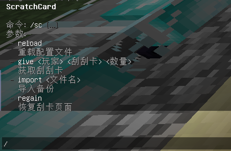

# 插件介绍

## 刮刮乐

### **适用版本**

> 1.8-1.20

### **依赖插件**

> - 必要: MythicMobs
> - 可选: PlayerPoints
> - 可选: Vault
> - 可选: NeigeItems
> - 可选: OriginAttribute
> - 可选: SX-Attribute

### **插件介绍**

> - 支持JSON,MySQL存储
> - 刮出的号码和中奖号码相同就获得对应奖励
> - 每个奖励有次数统计(抽到会重置)和保底
> - 奖励支持MythicMobs,SX-Attribute,NeigeItems,OriginAttribute物品库
> - 奖励支持Vault,PlayerPoints货币

#### 插件指令



### **效果展示**

#### [【ScratchCard 使用视频】](https://www.bilibili.com/video/BV1XN411L7iQ/?share_source=copy_web&vd_source=92b2fd908671149c91aa9aa2d1163754)


### **配置文件**

<details>
<summary>config.yml</summary>

  ```yaml
# 您的授权码
code: "IKUN-JNTM-SZ666-SUSHAN"
database:
  # 开启MySQL
  enable: false
  # 数据库
  mysql:
    host: localhost
    port: 3306
    user: root
    password: root
    database: minecraft
# 备份
backup:
  # 备份间隔,支持单位: d,h,m,s
  # 例如: 1h30m
  period: 8h
  # 保留备份文件数量
  reserve: 100

  ```

</details>


<details>
<summary>刮刮卡示例配置</summary>

  ```yaml
# GUI方案,对应路径 plugins/ScratchCard/gui/方案名.yml
gui: "test.yml"
# 中奖号码,0为随机,大于0为固定
win-number: 0
card:
  material: PAPER
  name: "§e§l花开富贵"
  lore:
    - "§d刮刮卡"
# 奖励列表
# 帮助文档 https://www.goodmc.cn/docs/ScratchCard/description/reward
reward:
  # 可随意命名
  10000金币:
    # 显示的名字
    name: "§e10000金币"
    # 概率,1.0为100%
    probability: 0.5
    # 出现的权重
    weight: 100
    # 保底,不用则填0或删除
    must: 0
    list:
      - "type=money,amount=1000"
      - "type=message,message='§a恭喜玩家 §e%player_name% §a在花开富贵中开出了 §e10000金币'"
  500点券:
    # 显示的名字
    name: "§e500点券"
    # 概率,1.0为100%
    probability: 0.1
    # 出现的权重
    weight: 20
    # 保底,不用则填0或删除
    must: 10
    # 奖励列表
    list:
      - "type=playerpoints,amount=500"
      - "type=message,message='§a恭喜玩家 §e%player_name% §a在花开富贵中开出了 §e500点券'"
  解锁材料:
    # 显示的名字
    name: "§e解锁材料"
    # 数量
    amount: 10
    # 概率,1.0为100%
    probability: 0.25
    # 保底,不用则填0或删除
    must: 10
    # 出现的权重
    weight: 50
    # 奖励列表
    list:
      - "type=mm,id=解锁材料,amount=10"
      - "type=message,message='§a恭喜玩家 §e%player_name% §a在花开富贵中开出了 §e解锁材料'"
  ```

</details>


<details>
<summary>刮刮卡GUI示例配置</summary>

  ```yaml
# GUI标题
title: "§e§l花         开         富         贵"
# 中奖号码刮开前
win-scratch-after: W
# 中奖号码
win-number: w
# 我的号码刮开前模板
my-scratch-after: M
# 我的号码
my-number: m
status:
  win: "§c已中奖"
  fail: "§f无中奖"
# 页面布局
layout:
  - "####W####"
  - "#########"
  - "#MMMMMMM#"
  - "#MMMMMMM#"
  - "#MMMMMMM#"
  - "#########"
#布局材料及槽位
materials:
  "#":
    material: GRAY_STAINED_GLASS_PANE
    name: " "
    lore:
      - "§f "
  "W":
    material: MUSHROOM_STEW
    name: "§f点击刮开中奖号码"
    lore:
      - "§f"
  "w":
    material: SUNFLOWER
    name: "§f中奖号码: §f§l%number%"
    lore:
      - "§f "
  "M":
    material: MUSHROOM_STEW
    name: "§f点击刮开"
    lore:
      - " "
  "m":
    material: BOWL
    name: "§f号码: §6§l%number%"
    lore:
      - "§f奖励: %reward%"
      - "§f已开: %total%"
      - "§f保底: %must%"
      - "%status%"
  ```

</details>

