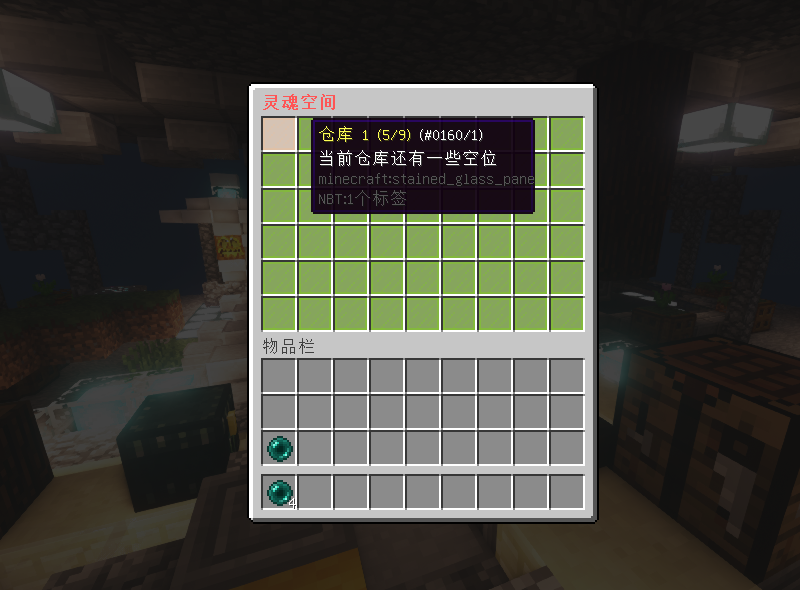
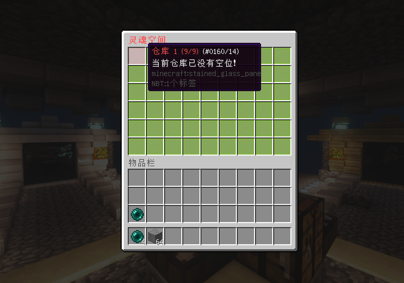

# 插件介绍

## 更好的灵魂空间

### **适用版本**

> 1.12.2

### **依赖插件**

> - 必要: SimpleLib (群内下载)
> - 必要: MythicMobs
> - 可选: PlayerPoints
> - 可选: Vault
> - 可选: NeigeItems
> - 可选: PlaceholderAPI

### **插件介绍**

> - 支持JSON,SQLite,MySQL三种存储方式
> - 支持槽位解锁数量,所需金币,所需点券要求,每页最多可放入45格物品
> - 支持NeigeItems,MythicMobs物品给予玩家仓库
> - 支持定时备份和手动备份玩家数据
> - 支持完整导入KLRing玩家数据
> - 自动拾取MythicMobs怪物Drops
> - 自动拾取地上掉落物
> - 自定义设置每页解锁方案
> - 自定义设置不同权限玩家页数上限

#### 插件指令


### **效果展示**


)

### **仓库剩余空间**


)


### **配置文件**

<details>
<summary>config.yml</summary>

  ```yaml
 Config:
   # 您的授权码
   Code: "IKUN-JNTM-SZ666-SUSHAN"
   # 存储方式 JSON,SQLite,MySQL
   # MySQL连接配置请在插件 SimpleLib 配置文件中配置
   Storage: "JSON"
   # 备份
   Backup:
     # Quartz表达式在线生成 https://www.pppet.net/
     # 例子：
     # 整点 0 0 0/1 * * ?
     # 每隔30分钟 0 0/30 * * * ?
     #
     # 默认整点触发
     cron: "0 0 0/1 * * ?"
     # 保留备份文件数量
     reserve: 100
   SpacePage:
     # 不同点击方式放入和取出的数量
     # 填9999这样的大值可以实现全部存入或者是全部取出
     # 鼠标左键
     left_click: 1
     # 鼠标右键
     right_click: 64
     # Shift + 鼠标左键键
     shift_left_click: 9999
     # Shift + 鼠标右键
     shift_right_click: 9999
   # 空间戒指
   Ring:
     Name: "§e空间戒指"
     Id: 368
     Data: 0
     Lore:
       - "§c§m                       "
       - "§7点 击 打开空间默认页"
       - "§7Shift + 右键打开首页"
       - "§7Shift + 左键切换模式"
       - "§c§m                       "
       - "%state%自动拾取"
     enable: "§a已开启"
     disable: "§c已关闭"
     # 是否允许丢弃
     drop: false
  ```

</details>


<details>
<summary>gui.yml</summary>

  ```yaml
  HomePage:
  Title: "§c§l灵魂空间"
  enough:
    Name: "§a仓库 %pageNum% (%use%/%volume%)"
    Id: 160
    Data: 5
    Lore:
      - "§f当前空位充足"
  some:
    Name: "§e仓库 %pageNum% (%use%/%volume%)"
    Id: 160
    Data: 1
    Lore:
      - "§f当前仓库还有一些空位"
  full:
    Name: "§c仓库 %pageNum% (%use%/%volume%)"
    Id: 160
    Data: 14
    Lore:
      - "§f当前仓库已没有空位！"
  SpacePage:
    Title: "§c§l仓库 §a第§e%pageNum%§a页"
    # 自定义按钮,支持以下变量+PAPI变量
    # 本页已用空间 %use%
    # 本页剩余空间 %volume%
    # 解锁所需材料 %material%
    # 解锁材料数量 %amount%
    # 解锁所需金币 %money%
    # 解锁所需点券 %point%
    # 每次解锁格数 %unlock%
    # 本页堆叠上限 %stack%
    Custom:
      # 可以按照该模板自行添加修改
      intro:
        Id: 54
        Data: 0
        Name: "§e当前容量: §f%use%/%volume%"
        Lore:
          - "§a解锁材料: §e%material%§fX%amount%"
          - "§a解锁金币: §f%money%"
          - "§a解锁点券: §f%point%"
          - "§a解锁格数: §f%unlock%"
          - "§a堆叠上限: §f%stack%"
          - "§f"
          - "§a单击左键 §f存入/取出 §a1个"
          - "§a单击右键 §f存入/取出 §a64个"
          - "§a单击+SHIFT §f存入/取出 §a全部"
        # 按钮位置不要填灵魂空间存储区域，否则会出问题
        Index: 49
          # 后台执行指令
          # Commands:
          # 默认后台执行
          # - "msg %player_name% 点击1成功"
          # 玩家执行
        # - "player:msg %player_name% 点击1成功"
        # OP执行
        # - "op:msg %player_name% 点击1功"
    # 魂珠增加的lore
    Item:
      Lore:
        - " "
        - "§a数量: §e%amount%"
    Trash:
      Id: 327
      Data: 0
      Name: "§2§l灵魂空间 - §c§l垃圾桶"
      Lore:
        - "§c点击切换至垃圾桶页面"
      Index: 50
      Title: "§c§l垃圾桶"
    # 未解锁
    Lock:
      Name: "§c未解锁"
      Id: 160
      Data: 15
      Lore:
        - "§f点击解锁"
      Index: 8
    # 上一页
    PageUp:
      Name: "§f上一页"
      Id: 262
      Data: 0
      Lore:
        - "§a点击打开上一页"
    # 下一页
    PageDown:
      Name: "§f下一页"
      Id: 262
      Data: 0
      Lore:
        - "§a点击打开下一页"

  ```

</details>

<details>
<summary>unlock.yml</summary>

  ```yaml
 HomePage:
 # 使用该功能后玩家默认仓库为9页
 # 格式仓库页数大小: 权限
 # 仓库大小应为9的倍数,最大54
 # 需要开启该功能把以下注释删掉即可
 # 18: "srp.page.18"
 # 27: "srp.page.27"
 # 36: "srp.page.36"
 # 45: "srp.page.45"
 # 54: "srp.page.54"

 # 解锁方案
 UnlockSlot:
   # 默认所有页面的解锁配置
   default:
     # 每次解锁的格子数
     unlock: 9
     # 物品堆叠上限, 0为不限制
     stack: 0
     # 解锁材料,填写mm物品名
     # 所需前置 MythicMobs
     material: "默认解锁材料"
     # 所需解锁材料的数量
     amount: 1
     # 解锁所需点券,填0则不需要
     # 所需前置 PlayerPoints
     point: 100
     # 解锁所需金币,填0则不需要
     # 所需前置 Vault
     money: 100
   # 第一页解锁配置
   1:
     unlock: 9
     stack: 0
     material: "第一页解锁材料"
     amount: 1
     point: 100
     money: 100
   # 第二页解锁配置
   2:
     unlock: 9
     stack: 0
     material: "第二页解锁材料"
     amount: 1
     point: 100
     money: 100
  ```

</details>


<details>
<summary>message.yml</summary>

  ```yaml
 Message:
   reload: "§a配置文件重载成功"
   permission_false: "§a您的权限不够"
   param_false: "§a参数不完整"
   online_false: "§a玩家 §e{0} §a不在线"
   player_null: "§a请输入玩家名."
   look_warn: "§a如果玩家在其它子服在线,本次操作若修改玩家数据将无效"
   pagedown_false: "§a这已经是最后一页了"
   pageup_false: "§a这已经是第一页了."
   unlock_true: "§a解锁成功."
   add_full: "§a空间已满,请解锁更多的槽位"
   add_page: "§a请到第 §e{0} §a页存储该物品"
   item_false: "§a该物品不能放入空间内"
   item_stack_limit: "§a该物品的存储数量已上限"
   ring_give_true: "§a空间戒指已给予玩家 §e{0}"
   ring_enable_true: "§a空间戒指拾取模式: §e已开启"
   ring_enable_false: "§a空间戒指拾取模式: §c已关闭"
   ring_drop_false: "§a空间戒指拾禁止丢弃"
   ring_inv_false: "§a空间戒指拾禁止放入"
   unlock_material_null: "§a空间解锁材料设置不正确,请联系服务器管理员解决"
   unlock_material_false: "§a您没有足够的解锁材料 {0}"
   unlock_money_false: "§a解锁该槽位需要 §e{0} §a金币"
   unlock_point_false: "§a解锁该槽位需要 §e{0} §a点券"
   space_add_true: "§a物品 §e{0}§fX{1} §a已进入灵魂空间第§e {2} §a页"
   space_add_false: "§a灵魂空间已满,物品 §e{0}§fX{1} §a已进入背包"
   backup_ing: "§a数据正在备份中..."
   backup_true: "§a数据备份完成,备份文件 §e{0}"
   give_type_false: "§a给予类型不正确"
   give_item_null: "§a物品 §e{0} §a不存在"
   give_ni_null: "§a服务器没有所需依赖 §eNeigeItems"
   give_mm_null: "§a服务器没有所需依赖 §eMythicMobs"
   import_mkdirs: "§a请将KLRing玩家数据文件放入目录 §e{0} §a然后重新执行一遍该指令"
   import_warn: "§c§l警告！本次操作将覆盖SpaceRingPlus现有玩家数据,请谨慎操作"
   import_ing: "§a数据正在导入中..."
   import_true: "§a数据导入成功"
  ```

</details>
