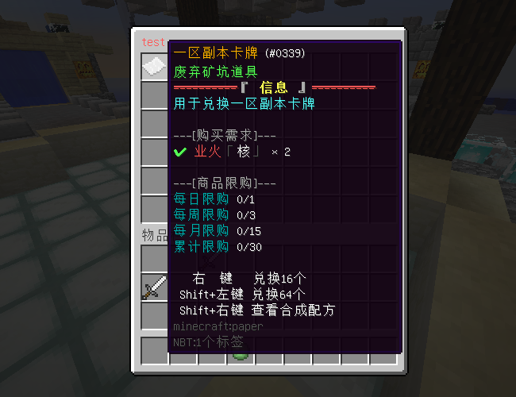

# 插件介绍

## SpaceRingShop

### **适用版本**

> 1.9-1.20

### **依赖插件**

> - 必要: SpaceRingPlus

### **插件介绍**

> - 本插件为SpaceRingPlus(灵魂空间)附属,插件灵感来着RPGShop
> - 支持JSON和MySQL两种存储方式
> - 支持消耗背包物品或灵魂空间物品两种兑换模式(每个商品可独立配置)
> - 支持购买的物品进入背包或灵魂空间两种模式(每个商品可独立配置)
> - 支持每日,每周,每月,累计四种限购模式
> - 支持Shift+左键快捷查看购买需求
> - 支持右键和Shift+右键倍率购买
> - 支持数据备份和数据导入

### 插件指令


### **效果展示**



### 商品限购


#### 高效的兑换编辑界面，物品放到对应位置即可，关闭GUI自动保存

[//]: # (![]&#40;img/兑换演示3.png&#41;)

### **配置文件**

<details>
<summary>config.yml</summary>

  ```yaml
# 您的授权码
code: "IKUN-JNTM-SZ666-SUSHAN"
# 商店默认参数
default-shop:
  # 物品扣除路径, Inventory 背包,SpaceRingPlus 灵魂空间
  take-route: SpaceRingPlus
  # 物品给予路径, Inventory 背包,SpaceRingPlus 灵魂空间
  give-route: Inventory
# 交易快捷键倍率
multiple:
  # 右键
  right-click: 16
  # Shift+鼠标左键
  shift-left-click: 64
database:
  # 开启MySQL
  enable: false
  # 数据库
  mysql:
    host: localhost
    port: 3306
    user: root
    password: root
    database: minecraft
# 备份
backup:
  # 备份间隔,支持单位: d,h,m,s
  # 例如: 1h30m
  period: 8h
  # 保留备份文件数量
  reserve: 100

  ```

</details>


<details>
<summary>gui.yml</summary>

  ```yaml
shop-trade:
  title: "%title%"
  direction:
    buy:
      - "§f"
      - "§7---[出售获得]---"
    sell:
      - "§f"
      - "§7---[购买需求]---"
    info:
      - "§f"
      - "§f   右  键   兑换16个"
      - "§f Shift+左键 兑换64个"
      - "§f Shift+右键 查看合成配方"
    limit-purchase:
      - "§f"
      - "§7---[商品限购]---"
  icons:
    buy: '§3◎§r'
    sell-enough: '§a§l✔§r'
    sell-insufficient: '§c✘§r'
  lore:
    item-notice:
      buy: '%icon% §f%item_name% §r× %amount%'
      sell: '%icon% §f%item_name% §r× %amount%'
    buy:
      check-enough: '§a(可以出售)'
      check-insufficient: '§c(§l没有足够的物品出售§r§c)'
    limit-purchase:
      day: "§3每日限购 §f%count%/%max%"
      week: "§3每周限购 §f%count%/%max%"
      month: "§3每月限购 §f%count%/%max%"
      total: "§3累计限购 §f%count%/%max%"
shop-edit:
  title: "商店编辑"
recipe-info:
  title: "配方详情"
recipe-edit:
  title: "设置交易物品需求"
  material:
    decorate:
      material: BLACK_STAINED_GLASS_PANE
      name: "§f "
      lore:
        - "§f "
    trade-type:
      material: TRIPWIRE_HOOK
      name: "§3设置该物品的出售方向"
      lore:
        - "§f当前 §e%type%"
    take-type:
      material: CHEST
      name: "§3设置扣除物品的路径"
      lore:
        - "§f当前 §e%type%"
    give-type:
      material: CHEST
      name: "§3设置给予物品的路径"
      lore:
        - "§f当前 §e%type%"
    limit-purchase:
      material: CHEST
      name: "§3限购配置"
      lore:
        - "§f每日限购 §e%day%"
        - "§f每周限购 §e%week%"
        - "§f每月限购 §e%month%"
        - "§f累计限购 §e%total%"
limit-purchase:
  title: "限购配置"
  material:
    decorate:
      material: BLACK_STAINED_GLASS_PANE
      name: "§f "
      lore:
        - "§f "
    day:
      material: NETHER_STAR
      name: "§3每日限购"
      lore:
        - "§f当前 §e%number%"
      amount: 1
    week:
      material: NETHER_STAR
      name: "§3每周限购"
      lore:
        - "§f当前 §e%number%"
      amount: 7
    month:
      material: NETHER_STAR
      name: "§3每月限购"
      lore:
        - "§f当前 §e%number%"
      amount: 30
    total:
      material: NETHER_STAR
      name: "§3累计限购"
      lore:
        - "§f当前 §e%number%"
      amount: 64


  ```

</details>
