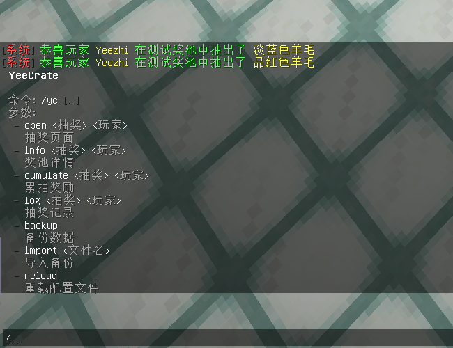

# 插件介绍

## YeeCrate

### **适用版本**

> 1.9-1.20

### **依赖插件**

> - 必要: MythicMobs
> - 可选: PlayerPoints
> - 可选: Vault
> - 可选: PlaceholderAPI

### **插件介绍**
> - 支持JSON和MySQL两种存储方式
> - 支持多奖池方案
> - 支持多奖池GUI方案
> - 支持奖池物品保底
> - 支持累充奖励
> - 支持抽奖记录查询,可显示抽奖物品和时间信息
> - 支持单抽和多抽(具体抽奖数量可自由配置)
> - 奖池物品可以配置抽取权重
> - 奖池物品支持预览概率,以及支持配置虚假概率
> - 支持数据备份和数据导入

### 插件指令



### **奖池预览**


### 抽奖记录


### 累抽奖励


[//]: # (![]&#40;img/兑换演示3.png&#41;)

### **配置文件**

<details>
<summary>奖池配置</summary>

  ```yaml
# GUI配置方案
gui: "demo"
# 奖池名
name: "§c§l测         试         奖         池"
# 抽奖次数
crate:
  a:
    # 抽奖钥匙mm物品库id
    key: "测试抽奖钥匙"
    # 所需钥匙数量
    amount: 1
    # 抽奖次数
    freq: 1
  b:
    key: "测试抽奖钥匙"
    amount: 9
    freq: 10
# 保底
guarantee:
  # 奖励ID
  reward: "白色羊毛"
  # 保底次数
  cumulate: 100
# 抽奖奖池
reward:
  白色羊毛:
    # 显示物品
    show:
      # 类型:
      # custom(自定义),
      # mm(mm物品库) 示例: id: "测试物品"
      type: custom
      material: WHITE_WOOL
      name: "§f白色羊毛"
      lore:
        - "§f"
      # 显示的概率(假概率)
      probability: 0.05
    # 权重
    weight: 2
    # 奖励列表
    list:
      - "type=command,command='give %player_name% 35:0 1'"
      - "type=message,message='§a恭喜玩家 §e%player_name% §a在测试奖池中抽出了 §e白色羊毛'"
  橙色羊毛:
    show:
      type: custom
      material: ORANGE_WOOL
    weight: 50
    list:
      - "type=command,command='give %player_name% 35:1 1'"
      - "type=message,message='§a恭喜玩家 §e%player_name% §a在测试奖池中抽出了 §e橙色羊毛'"
  品红色羊毛:
    show:
      type: custom
      material: MAGENTA_WOOL
    weight: 50
    list:
      - "type=command,command='give %player_name% 35:2 1'"
      - "type=message,message='§a恭喜玩家 §e%player_name% §a在测试奖池中抽出了 §e品红色羊毛'"
  淡蓝色羊毛:
    show:
      type: custom
      material: LIGHT_BLUE_WOOL
    weight: 50
    list:
      - "type=command,command='give %player_name% 35:3 1'"
      - "type=message,message='§a恭喜玩家 §e%player_name% §a在测试奖池中抽出了 §e淡蓝色羊毛'"
  黄色羊毛:
    show:
      type: custom
      material: YELLOW_WOOL
    weight: 50
    list:
      - "type=command,command='give %player_name% 35:4 1'"
      - "type=message,message='§a恭喜玩家 §e%player_name% §a在测试奖池中抽出了 §e黄色羊毛'"
  黄绿色羊毛:
    show:
      type: custom
      material: LIME_WOOL
    weight: 50
    list:
      - "type=command,command='give %player_name% 35:5 1'"
      - "type=message,message='§a恭喜玩家 §e%player_name% §a在测试奖池中抽出了 §e黄绿色羊毛'"
  粉红色羊毛:
    show:
      type: custom
      material: PINK_WOOL
    weight: 50
    list:
      - "type=command,command='give %player_name% 35:6 1'"
      - "type=message,message='§a恭喜玩家 §e%player_name% §a在测试奖池中抽出了 §e粉红色羊毛'"
  灰色羊毛:
    show:
      type: custom
      material: GRAY_WOOL
    weight: 50
    list:
      - "type=command,command='give %player_name% 35:7 1'"
      - "type=message,message='§a恭喜玩家 §e%player_name% §a在测试奖池中抽出了 §e灰色羊毛'"
  淡灰色羊毛:
    show:
      type: custom
      material: LIGHT_GRAY_WOOL
    weight: 50
    list:
      - "type=command,command='give %player_name% 35:8 1'"
      - "type=message,message='§a恭喜玩家 §e%player_name% §a在测试奖池中抽出了 §e淡灰色羊毛'"
  青色羊毛:
    show:
      type: custom
      material: CYAN_WOOL
    weight: 50
    list:
      - "type=command,command='give %player_name% 35:9 1'"
      - "type=message,message='§a恭喜玩家 §e%player_name% §a在测试奖池中抽出了 §e青色羊毛'"
  紫色羊毛:
    show:
      type: custom
      material: PURPLE_WOOL
    weight: 50
    list:
      - "type=command,command='give %player_name% 35:10 1'"
      - "type=message,message='§a恭喜玩家 §e%player_name% §a在测试奖池中抽出了 §e紫色羊毛'"
  蓝色羊毛:
    show:
      type: custom
      material: BLUE_WOOL
    weight: 50
    list:
      - "type=command,command='give %player_name% 35:11 1'"
      - "type=message,message='§a恭喜玩家 §e%player_name% §a在测试奖池中抽出了 §e蓝色羊毛'"
  棕色羊毛:
    show:
      type: custom
      material: BROWN_WOOL
    weight: 50
    list:
      - "type=command,command='give %player_name% 35:12 1'"
      - "type=message,message='§a恭喜玩家 §e%player_name% §a在测试奖池中抽出了 §e棕色羊毛'"
  绿色羊毛:
    show:
      type: custom
      material: GREEN_WOOL
    weight: 50
    list:
      - "type=command,command='give %player_name% 35:13 1'"
      - "type=message,message='§a恭喜玩家 §e%player_name% §a在测试奖池中抽出了 §e绿色羊毛'"
  红色羊毛:
    show:
      type: custom
      material: RED_WOOL
    weight: 50
    list:
      - "type=command,command='give %player_name% 35:14 1'"
      - "type=message,message='§a恭喜玩家 §e%player_name% §a在测试奖池中抽出了 §e红色羊毛'"
  黑色羊毛:
    show:
      type: custom
      material: BLACK_WOOL
    weight: 50
    list:
      - "type=command,command='give %player_name% 35:15 1'"
      - "type=message,message='§a恭喜玩家 §e%player_name% §a在测试奖池中抽出了 §e黑色羊毛'"
# 累计抽奖奖励
cumulate:
  3抽:
    # 显示物品
    show:
      material: CHEST
      name: "§f3抽"
      lore:
        - "§f "
        - "§f- §e10000金币"
        - "§f- §e500点券"
        - "§f "
        - "%state%"
      amount: 3
    # 所需累抽次数
    need: 3
    # 奖励
    list:
      - "type=money,amount=10000"
      - "type=playerpoints,amount=500"
    # 显示位置
    index: 10
  5抽:
    show:
      material: CHEST
      name: "§f5抽"
      lore:
        - "§f "
        - "§f- §e50000金币"
        - "§f- §e1000点券"
        - "§f "
        - "%state%"
      amount: 5
    need: 5
    list:
      - "type=money,amount=50000"
      - "type=playerpoints,amount=1000"
    index: 12

  10抽:
    show:
      material: CHEST
      name: "§f10抽"
      lore:
        - "§f "
        - "§f- §e100000金币"
        - "§f- §e2000点券"
        - "§f "
        - "%state%"
      amount: 10
    need: 10
    list:
      - "type=money,amount=100000"
      - "type=playerpoints,amount=2000"
    index: 14

  15抽:
    show:
      material: CHEST
      name: "§f15抽"
      lore:
        - "§f "
        - "§f- §e200000金币"
        - "§f- §e5000点券"
        - "§f "
        - "%state%"
      amount: 15
    need: 15
    list:
      - "type=money,amount=200000"
      - "type=playerpoints,amount=5000"
    index: 16


  ```

</details>


<details>
<summary>奖池GUI方案</summary>

  ```yaml
# 按钮
button:
  # 单抽
  one: A
  # 多抽
  multiple: B
  # 奖池详情
  info: I
  # 抽奖记录
  log: L
  # 累抽奖励
  cumulate: C
# 页面布局
layout:
  - "#########"
  - "###A#B###"
  - "#########"
  - "##I#L#C##"
  - "#########"
#布局材料及槽位
materials:
  "#":
    material: BLACK_STAINED_GLASS_PANE
    name: " "
    lore:
      - "§f "
  "A":
    material: END_PORTAL_FRAME
    name: "§f单抽"
    lore:
      - "§f "
      - "§f奖池钥匙: %key-a%§f*%key-amount-a%"
  "B":
    material: END_PORTAL_FRAME
    name: "§f10抽"
    lore:
      - "§f "
      - "§f奖池钥匙: %key-b%§f*%key-amount-b%"
  "I":
    material: ITEM_FRAME
    name: "§f奖池详情"
    lore:
      - "§f "
  "L":
    material: PLAYER_HEAD
    name: "§f抽奖记录"
    lore:
      - "§f "
      - "§f保底统计: %guarantee%"
  "C":
    material: CHEST
    name: "§f累抽奖励"
    lore:
      - "§f "
      - "§f当前: %crateTotal%"

  ```

</details>
